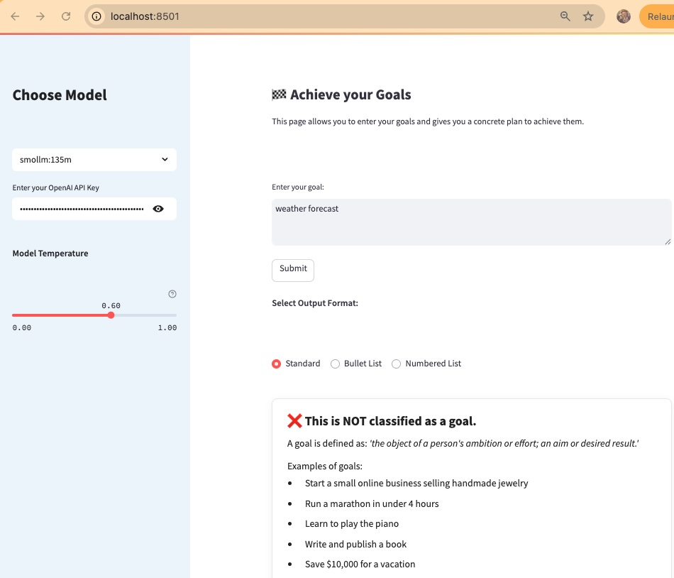

# Achieve your Goals – Task Breakdown App

---

## Overview

**Achieve your Goals** is a modern, interactive web application that helps users turn their ambitions into actionable plans. Powered by OpenAI's language models and built with Streamlit, this app allows you to enter any goal and receive a concrete, step-by-step plan to achieve it. The app is designed for clarity, compactness, and ease of use, making it ideal for anyone looking to break down complex objectives into manageable tasks.

**Purpose:**  
- Help users clarify their goals.  
- Automatically generate detailed, actionable plans.  
- Provide an intuitive, visually appealing interface for productivity and planning.

---

## App Interface Screenshot


*Above: The main interface of the app, featuring the goal input, temperature slider, output format selector, and sidebar for model/API key controls.*

---

## Additional Screenshots

### Example: Completed Task Breakdown Output


*This screenshot shows an example of the app after a user has submitted a goal and received a detailed, actionable plan generated by the AI. The output area displays the plan in the selected format, making it easy to follow and act on each step.*


### Example: Classifier Preventing Non-Goals



*The app includes a built-in classifier that prevents non-goal submissions. When a user enters something that is not an actionable goal (such as a question or topic), the app displays a clear message explaining that the input is not a goal, along with a definition and examples of valid goals. This ensures only meaningful, actionable goals are processed by the AI.*

---

## Functions & Features

### Core Functions

- **Goal Input & Validation**
  - Users enter their goal in a text area.
  - The app uses rule-based logic to ensure the input is actionable (not just a topic or question).
- **Task Breakdown Generation**
  - Valid goals are sent to OpenAI’s GPT model.
  - The model returns a structured, easy-to-follow plan.
- **Output Formatting**
  - Users can choose from three output styles:
    - Standard (mix of paragraphs, bullets, and numbered lists)
    - Bullet List (all tasks as bullet points)
    - Numbered List (sequential, step-by-step)
- **Sidebar Controls**
  - **Model Selector:** Choose from available AI models.
  - **API Key Input:** Securely enter your OpenAI API key.
  - **Temperature Slider:** Adjust the creativity of AI responses.

### Visual & Usability Features

- Compact, minimalist layout with custom CSS for spacing and readability.
- Responsive design for various screen sizes.
- Clear feedback and error messages for invalid input.

---

## Testing, Implementation & Future Recommendations

### Testing & Development Scripts

- **test_classifier.py:**  
  Standalone Streamlit page for testing the goal classifier and OpenAI integration.  
  - Validates the goal classification logic.
  - Displays sample outputs and error handling.
  - Useful for refining logic before deployment.

### Implementation Notes

- The main logic resides in `app.py`.
- The app uses environment variables or sidebar input for API key security.
- All UI and logic are thoroughly commented for maintainability.

### Recommended Future Features

- Save and export generated plans.
- Integrate with popular task management tools (e.g., Todoist, Trello).
- Add user authentication for personalized experiences.
- Support for multi-step or recurring goals.
- Enhanced goal validation using NLP or LLMs for greater accuracy.

---

## Summary

**Achieve your Goals** empowers users to move from intention to action with AI-driven planning. With its clean interface, robust validation, and flexible output options, it’s a practical tool for anyone seeking clarity and momentum in their personal or professional projects.

If you have suggestions or would like to contribute, please open an issue or submit a pull request!

---

## Supported LLM Models

- **OpenAI:**
  - `gpt-3.5-turbo` (default)
  - Other OpenAI models can be easily configured
  - Requires your own OpenAI API key (never stored or uploaded)

## How to Run
1. **Install dependencies:**
    ```bash
    pip install -r requirements.txt
    ```
2. **Set up your OpenAI API key:**
    - Create a `.env` file in the project root with your OpenAI API key:
    ```
    OPENAI_API_KEY=your_api_key_here
    ```
    - Or enter it directly in the app's sidebar

3. **Run the app:**
    ```bash
    streamlit run app.py
    ```
4. **Open in your browser** at the URL provided by Streamlit (typically http://localhost:8501)

## App Structure & Logic
- **Main Components:**
  - `app.py`: Primary application file with UI and API integration
  - `main.py`: Backend logic for the task generation agent
  - Custom CSS for optimal layout and spacing

- **Key Features:**
  - Goal validation to ensure proper input
  - Dynamic prompt engineering based on selected output format
  - Temperature control for adjusting AI creativity
  - Responsive design with optimized spacing

- **How It Works:**
  1. User enters a goal in the text area
  2. App validates if the input is a proper goal
  3. User selects desired output format (Standard, Bullet List, or Numbered List)
  4. OpenAI API processes the goal with format-specific instructions
  5. Response is displayed with appropriate formatting and spacing

## Security Notes
- **No API keys or sensitive data are ever stored or uploaded.**
- `.env`, OpenAI key files, and personal notes are excluded from the repository.
- Only public, non-sensitive code and assets are included.

## Credits
- Built with [Streamlit](https://streamlit.io/), [OpenAI](https://openai.com/), and [Ollama](https://ollama.ai/).

---
If you have questions or want to contribute, please open an issue or pull request!
